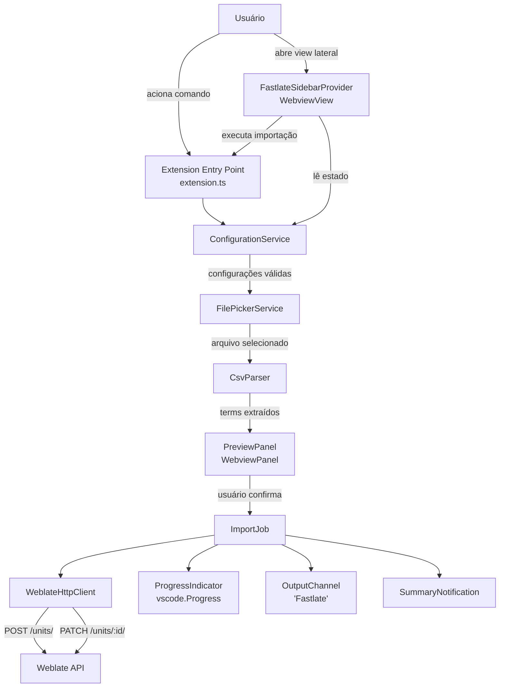

# Design Document

## Overview

A extensão **Fastlate** é uma extensão VSCode que automatiza a importação de termos de tradução para o servidor Weblate. O usuário seleciona um arquivo CSV contendo termos e suas traduções, visualiza os dados em um painel de preview, confirma a importação e a extensão envia os termos ao Weblate via API REST — criando cada termo com `POST` e editando-o com `PATCH`.

O fluxo principal é:

1. Usuário aciona o comando `fastlate.importTranslations` pela Command Palette ou pela visualização lateral Fastlate
2. Extensão valida as configurações de conexão e o idioma padrão
3. Usuário seleciona um arquivo CSV
4. Parser lê e valida o arquivo, extraindo o Language_Header e os Terms
5. Preview_Panel exibe os dados para confirmação
6. Usuário confirma → Import_Job processa cada Term sequencialmente via Weblate API
7. Resumo final é exibido ao usuário

### Pesquisa e Decisões de Design

**Weblate API (v4.5+):** A partir da versão 4.5, glossários são armazenados como componentes/traduções/unidades regulares. Os endpoints relevantes são:
- Criar termo: `POST /api/translations/{project}/{component}/{language}/units/` com campos `key`, `value` (array), `state`
- Editar termo: `PATCH /api/units/{id}/` com campos `target` (array), `state`
- Listar unidades existentes: `GET /api/units/?q=project:="{project}" component:="{component}" language:="{language}"` para montar um mapa `key -> id` por idioma
- Autenticação: cabeçalho `Authorization: Token {token}`
- HTTP 201 = criado com sucesso; HTTP 400 com mensagem de chave duplicada = já existente; HTTP 401/403 = erro de autenticação

**Parser CSV:** A biblioteca [papaparse](https://www.papaparse.com/) é a escolha padrão para parsing de CSV em Node.js/TypeScript. O Fastlate usa ponto-e-vírgula (`;`) como delimitador obrigatório, com suporte a encoding UTF-8 com BOM e leitura síncrona de strings.

**VSCode Webview:** O Preview_Panel será implementado como um `vscode.WebviewPanel` com HTML/CSS/JS embutido, comunicando-se com a extensão via `postMessage`. A visualização lateral será implementada como um `vscode.WebviewViewProvider`, contribuída por `viewsContainers.activitybar` e `views`, para mostrar o estado de configuração e iniciar o mesmo comando de importação.

**HTTP Client:** A extensão usará a biblioteca `node-fetch` (ou o módulo nativo `https` do Node.js) para requisições HTTP, com lógica de retry implementada manualmente.

---

## Architecture



O fluxo de dados é unidirecional: cada camada recebe dados da anterior e os transforma. Não há estado global compartilhado — o `ImportJob` recebe a lista de `Term[]` e a `Configuration` como parâmetros imutáveis.

---

## Components and Interfaces

### ConfigurationService

Responsável por ler e validar as configurações do VSCode (`settings.json`).

```typescript
interface WeblateConfiguration {
  serverUrl: string;       // fastlate.serverUrl
  authToken: string;       // VSCode SecretStorage: fastlate.authToken
  project: string;         // fastlate.project
  component: string;       // fastlate.component
  defaultLanguage: string;  // fastlate.defaultLanguage
}

interface ConfigurationService {
  readConfiguration(authToken: string | undefined): Result<WeblateConfiguration, ConfigurationError>;
}

type ConfigurationError =
  | { kind: 'missing_field'; field: string }
  | { kind: 'invalid_url'; value: string };
```

Regras de validação:
- `serverUrl`, `project`, `component`, `defaultLanguage` e o token seguro são obrigatórios e não podem ser apenas espaços em branco
- `serverUrl` deve começar com `http://` ou `https://` e ter host não vazio
- `authToken` é salvo no `SecretStorage` do VSCode por comandos dedicados (`fastlate.configureToken` e `fastlate.removeToken`)
- `defaultLanguage` é obrigatório, deve existir como coluna no CSV, serve como idioma fonte das chaves e define o único código de idioma usado para criação via `POST`

### CsvParser

Responsável por ler e interpretar arquivos CSV.

```typescript
interface LanguageHeader {
  name: string;   // linha 1: ex. "Português"
  code: string;   // linha 2: ex. "pt"
}

interface TermValue {
  language: LanguageHeader;
  value: string;
}

interface Term {
  key: string;
  value: string;
  values?: TermValue[];
  sourceRow: number;  // número da linha original (para logs)
}

interface ParseResult {
  languageHeader: LanguageHeader;
  languageHeaders: LanguageHeader[];
  terms: Term[];
}

interface CsvParser {
  parseFile(filePath: string): Result<ParseResult, ParseError>;
}

type ParseError =
  | { kind: 'file_read_error'; message: string }
  | { kind: 'missing_language_header' }
  | { kind: 'missing_default_language_column'; languageCode: string }
  | { kind: 'empty_spreadsheet' }
  | { kind: 'insufficient_columns' };
```

Comportamento:
- Usa `papaparse` com `dynamicTyping: false` para preservar valores exatos das células como strings
- Usa ponto-e-vírgula (`;`) como delimitador obrigatório via `delimiter: ';'`
- Decodifica UTF-8 com BOM removendo o BOM (`\uFEFF`) antes do parsing
- Linha 1 = nomes dos idiomas, linha 2 = códigos dos idiomas, linhas 3+ = dados
- CSVs com coluna dedicada usam a coluna A como chave e as colunas B+ como idiomas
- CSVs sem coluna dedicada usam as colunas A+ como idiomas; nesses casos, `fastlate.defaultLanguage` define qual coluna fornece a chave de cada linha
- Todo CSV deve conter uma coluna cujo código de idioma seja igual a `fastlate.defaultLanguage`; caso contrário, o parser retorna erro antes de qualquer chamada ao Weblate
- Linhas com chave vazia ou todos os valores de idioma vazios são ignoradas com aviso no OutputChannel incluindo o número da linha
- Requer pelo menos uma coluna de idioma válida

### PreviewPanel

Implementado como `vscode.WebviewPanel`. Exibe os dados lidos antes da importação.

```typescript
interface PreviewPanelOptions {
  languageHeader: LanguageHeader;
  languageHeaders: LanguageHeader[];
  terms: Term[];
}

type PreviewAction = 'import' | 'cancel';

interface PreviewPanel {
  show(options: PreviewPanelOptions): Promise<PreviewAction>;
  dispose(): void;
}
```

O painel exibe:
- Idiomas declarados na planilha
- Total de terms lidos
- Tabela com coluna "Chave" e uma coluna de valor para cada idioma declarado (somente leitura)
- Botões "Importar" e "Cancelar"

Comunicação via `webview.postMessage` / `webview.onDidReceiveMessage`. O painel é somente leitura — nenhum campo é editável. Ao clicar em "Importar", o painel resolve a ação de importação, altera o botão para "Importando...", exibe o status "Importando termos...", desabilita as ações de envio/cancelamento e permanece aberto para conferência. A extensão re-renderiza o HTML do painel para refletir os estados de importação, conclusão e erro; quando o job termina, a view troca o estado visual para concluído ou erro e reabilita o botão "Fechar".

### FastlateSidebarProvider

Implementado como `vscode.WebviewViewProvider`. Exibe um ponto de entrada permanente na Activity Bar para iniciar a importação e conferir rapidamente se a configuração mínima está pronta.

```typescript
interface FastlateSidebarProvider extends vscode.WebviewViewProvider {
  resolveWebviewView(view: vscode.WebviewView): void;
  refresh(): void;
}
```

A view exibe:
- Estado de `serverUrl`, token seguro, `project`, `component` e `defaultLanguage`
- Status geral pronto/incompleto
- Botão "Importar CSV" que executa `fastlate.importTranslations`
- Botão para abrir as configurações Fastlate (`fastlate`)

Regras:
- O valor de `authToken` nunca é exibido; apenas o estado configurado/ausente.
- A view é renderizada novamente quando `workspace.onDidChangeConfiguration` indicar alteração em `fastlate.*`.
- O `package.json` contribui `viewsContainers.activitybar` e `views` para tornar a extensão visível na barra lateral.

### WeblateHttpClient

Responsável por todas as requisições HTTP ao Weblate.

```typescript
interface CreateTermRequest {
  key: string;
  value: string[];
  state: number;  // 20 = translated
}

interface EditTermRequest {
  target: string[];
  state: number;  // 20 = translated
}

type TermCreationResult =
  | { kind: 'created'; unitId: number }
  | { kind: 'already_exists'; message?: string }
  | { kind: 'auth_error' }
  | { kind: 'error'; statusCode: number; message: string };

type TermEditResult =
  | { kind: 'success' }
  | { kind: 'not_found' }
  | { kind: 'auth_error' }
  | { kind: 'error'; statusCode: number; message: string };

interface WeblateHttpClient {
  createTerm(
    config: WeblateConfiguration,
    languageCode: string,
    term: Term
  ): Promise<TermCreationResult>;

  listTermIds(
    config: WeblateConfiguration,
    languageCode: string
  ): Promise<Map<string, number>>;

  editTerm(
    config: WeblateConfiguration,
    unitId: number,
    value: string
  ): Promise<TermEditResult>;
}
```

Lógica de retry (Requisito 7):
- Timeout de 10 segundos por requisição
- Até 3 tentativas com intervalo de 2 segundos entre elas
- Retry apenas para erros de rede/timeout e HTTP 5xx
- Não faz retry para HTTP 4xx

### ImportJob

Orquestra o processamento sequencial de todos os Terms.

```typescript
interface ImportSummary {
  total: number;
  created: number;       // POST 201 + PATCH 200
  onlyEdited: number;    // POST 400 duplicado + PATCH 200
  errors: number;        // falhas definitivas
  failedKeys: string[];   // chaves únicas que tiveram falha definitiva
}

interface ImportJobOptions {
  config: WeblateConfiguration;
  languageCode: string;
  terms: Term[];
  cancellationToken: vscode.CancellationToken;
  progress: vscode.Progress<{ message?: string; increment?: number }>;
}

interface ImportJob {
  run(options: ImportJobOptions): Promise<ImportSummary>;
}
```

Fluxo de importação:
1. `POST /api/translations/{project}/{component}/{language}/units/` usando `config.defaultLanguage` como `{language}`; nenhum outro idioma realiza criação via `POST`
2. Se HTTP 201 → marca como "criado"; se HTTP 400 com chave duplicada → marca como "já existente" e continua
3. Para cada idioma com valores preenchidos, lista unidades via `GET /api/units/?q=project:="{project}" component:="{component}" language:="{language}"` e monta um mapa `key -> id`
4. Se HTTP 401/403 → interrompe o job imediatamente
5. Se outro erro → registra, contabiliza como erro, prossegue para o próximo Term
6. Para cada Term do idioma, busca a chave exata no mapa local e executa `PATCH /api/units/{unitId}/` com o valor de tradução
7. Atualiza progresso após conclusão de criação + edição

Se a planilha não contiver uma coluna cujo `Language_Header.code` corresponda a `config.defaultLanguage`, a extensão exibe "Coluna com idioma padrão não encontrada" e interrompe o fluxo antes do `ImportJob`.

### OutputChannel

Canal de saída dedicado chamado `"Fastlate"` no painel Output do VSCode.

```typescript
interface FastlateLogger {
  warn(message: string): void;
  error(message: string): void;
  info(message: string): void;
}
```

---

## Data Models

### Configuração VSCode (`package.json` contribuições)

```json
{
  "contributes": {
    "configuration": {
      "title": "Fastlate",
      "properties": {
        "fastlate.serverUrl": {
          "type": "string",
          "description": "URL base do servidor Weblate (ex.: https://weblate.example.com)"
        },
        "fastlate.project": {
          "type": "string",
          "description": "Slug do projeto Weblate"
        },
        "fastlate.component": {
          "type": "string",
          "description": "Slug do componente Weblate"
        },
        "fastlate.defaultLanguage": {
          "type": "string",
          "description": "Código obrigatório do idioma padrão. O CSV deve conter esta coluna; ela serve como idioma fonte das chaves e é a única que cria chaves via POST (ex.: pt_BR)"
        }
      }
    },
    "commands": [
      {
        "command": "fastlate.importTranslations",
        "title": "Fastlate: Importar Traduções"
      },
      {
        "command": "fastlate.configureToken",
        "title": "Fastlate: Configurar token"
      },
      {
        "command": "fastlate.removeToken",
        "title": "Fastlate: Remover token"
      }
    ],
    "viewsContainers": {
      "activitybar": [
        {
          "id": "fastlate",
          "title": "Fastlate",
          "icon": "resources/fastlate.svg"
        }
      ]
    },
    "views": {
      "fastlate": [
        {
          "id": "fastlate.sidebar",
          "name": "Importar Traduções",
          "type": "webview"
        }
      ]
    }
  }
}
```

### Estrutura do Arquivo CSV

```
Português;Inglês;Espanhol
pt_BR;en;es
Salvar;Save;Guardar
Cancelar;Cancel;Cancelar
```

Com `fastlate.defaultLanguage = "pt_BR"`, as chaves são `Salvar` e `Cancelar`. Em CSVs com coluna dedicada, a coluna A continua sendo a chave, mas o CSV ainda deve conter a coluna `pt_BR`, pois ela é o idioma fonte usado no `POST` de criação.

### Term Status (Term_Status)

| Status | Condição |
|--------|----------|
| `created` | POST retornou 201 E PATCH retornou 200 |
| `only_edited` | POST retornou 400 (chave duplicada) E PATCH retornou 200 |
| `error` | Qualquer falha definitiva na criação ou edição |

### Weblate API Endpoints Utilizados

| Operação | Método | Endpoint |
|----------|--------|----------|
| Criar termo | POST | `/api/translations/{project}/{component}/{language}/units/`, com `{language}` vindo de `fastlate.defaultLanguage` |
| Listar unidades existentes | GET | `/api/units/?q=project:="{project}" component:="{component}" language:="{language}"`, com `{language}` vindo de `Language_Header.code` |
| Editar termo | PATCH | `/api/units/{id}/` |

---

## Error Handling

### Hierarquia de Erros

```
FastlateError
├── ConfigurationError
│   ├── MissingFieldError (campo obrigatório ausente)
│   └── InvalidUrlError (URL inválida)
├── ParseError
│   ├── FileReadError (arquivo corrompido ou inacessível)
│   ├── MissingLanguageHeaderError (linhas 1 ou 2 vazias)
│   ├── EmptySpreadsheetError (nenhum term após linha 2)
│   └── InsufficientColumnsError (menos de 2 colunas)
└── ApiError
    ├── AuthenticationError (HTTP 401/403)
    ├── NetworkError (timeout, conexão recusada)
    └── UnexpectedStatusError (outros códigos HTTP)
```

### Estratégia de Tratamento

| Erro | Comportamento |
|------|---------------|
| Configuração inválida | Exibe mensagem de erro descritiva, interrompe o job |
| Arquivo corrompido | Exibe mensagem de erro, interrompe o job |
| Planilha vazia | Exibe mensagem informativa, interrompe o job |
| Usuário fecha diálogo | Cancela silenciosamente (sem mensagem) |
| HTTP 401/403 | Interrompe o job imediatamente, exibe erro de autenticação |
| HTTP 400 (chave duplicada) | Registra aviso, não contabiliza como erro, prossegue para edição |
| HTTP 400 (outro motivo) | Registra no OutputChannel, contabiliza como erro, continua |
| HTTP 404 na edição | Registra no OutputChannel, contabiliza como erro, continua |
| HTTP 5xx / timeout | Aplica retry (3x, intervalo 2s), depois registra e continua |
| Servidor inacessível no início | Exibe erro de conectividade, interrompe o job |
| Cancelamento pelo usuário | Aguarda requisição em andamento, exibe resumo parcial |

### Detecção de Chave Duplicada

Quando o HTTP 400 indicar chave duplicada, a extensão deve registrar a resposta como aviso, preservar a mensagem retornada pelo Weblate em `{ kind: 'already_exists', message }`, não incrementar a contagem de erros e continuar para busca exata + PATCH.

A resposta HTTP 400 do Weblate para chave duplicada contém uma mensagem no corpo JSON. A extensão verifica recursivamente o corpo da resposta e trata como duplicidade qualquer mensagem que contenha indicadores como `"already exist"`, `"Chave já criada"`, `"Chave já existe"`, ou o campo `"key"` no objeto de erros. Como a mensagem exata pode variar por versão do Weblate, a detecção deve ser tolerante a variações de texto e à posição da mensagem no JSON.

---

## Testing Strategy

### Abordagem Dual

A estratégia combina testes unitários baseados em exemplos com testes baseados em propriedades (PBT) para as partes com lógica pura e bem definida.

**Biblioteca PBT:** [fast-check](https://fast-check.io/) — biblioteca de property-based testing para TypeScript/JavaScript, madura e amplamente usada.

### Testes Unitários (Exemplos)

- **ConfigurationService**: exemplos de configurações válidas e inválidas (campos ausentes, URLs malformadas)
- **CsvParser**: exemplos de arquivos CSV com delimitadores diferentes, BOM, linhas vazias, estrutura inválida
- **PreviewPanel**: verificação de que o HTML gerado contém os elementos esperados (tabela, botões, contagem)
- **WeblateHttpClient**: testes com mocks de HTTP para cada código de status (201, 400 duplicado, 400 outro, 401, 403, 404, 5xx)
- **ImportJob**: testes de orquestração com mocks do `WeblateHttpClient`, verificando contagem de created/onlyEdited/errors

### Testes Baseados em Propriedades

Cada propriedade do design é implementada como um único teste PBT com mínimo de 100 iterações.

**Tag format:** `Feature: Fastlate, Property {N}: {texto da propriedade}`

| Propriedade | Geradores | Verificação |
|-------------|-----------|-------------|
| P1: Preservação de valores | Strings arbitrárias (Unicode, espaços, especiais) | `parser.parseFile(serialize(terms)).terms[i].value === original` |
| P2: Round-trip CSV | Listas de Terms com chaves/valores arbitrários | `parse(serialize(terms))` ≡ `terms` |
| P3: Rejeição de linhas inválidas | CSVs com mix de linhas válidas e inválidas | `result.terms.length === countValidRows(csv)` |
| P4: Delimitador ponto-e-vírgula | Listas de Terms sem ponto-e-vírgula nas células | `parse(serializeSemicolon(t))` preserva os Terms |
| P5: Validação de configuração | Configurações com campos ausentes/brancos/URLs inválidas, incluindo `defaultLanguage` ausente ou branco | `validate(config).isError === true` |

### Testes de Integração

- Verificação end-to-end com um servidor Weblate real ou mock HTTP (ex.: `nock`) para o fluxo completo de criação + edição
- Teste de retry: mock que falha N vezes antes de suceder, verificando que a extensão tenta exatamente 3 vezes

### Cobertura Mínima

- Todos os caminhos de erro do `ImportJob` devem ter cobertura por testes unitários
- Todas as propriedades do design devem ter um teste PBT correspondente

---

## Correctness Properties

*A property is a characteristic or behavior that should hold true across all valid executions of a system — essentially, a formal statement about what the system should do. Properties serve as the bridge between human-readable specifications and machine-verifiable correctness guarantees.*

### Property 1: Round-trip de parsing CSV

*Para qualquer* lista de Terms com chaves e valores arbitrários (incluindo caracteres especiais, espaços, Unicode e quebras de linha), serializar os Terms em formato CSV e depois fazer o parsing do resultado deve produzir uma lista de Terms com chaves e valores idênticos byte a byte aos originais.

**Validates: Requirements 8.1, 8.2, 2.2, 2.3, 3.1**

### Property 2: Delimitador ponto-e-vírgula

*Para qualquer* lista de Terms cujas chaves e valores não contenham ponto-e-vírgula, serializar como CSV com delimitador ponto-e-vírgula deve produzir, após parsing, uma lista de Terms equivalente.

**Validates: Requirements 2.4**

### Property 3: Filtragem de linhas inválidas

*Para qualquer* arquivo CSV onde algumas linhas (a partir da linha 3) possuem chave vazia, valor vazio, ou ambos, o Parser deve retornar apenas os Terms onde tanto a chave quanto o valor são não vazios, e o número de Terms retornados deve ser exatamente igual ao número de linhas com ambas as colunas preenchidas.

**Validates: Requirements 3.3, 3.4, 2.7**

### Property 4: Validação de configuração rejeita entradas inválidas

*Para qualquer* conjunto de configurações onde pelo menos um campo obrigatório está ausente, é composto apenas de espaços em branco, ou onde a URL não começa com `http://` ou `https://`, a função de validação deve retornar um erro descritivo e nunca retornar sucesso. Isso inclui `fastlate.defaultLanguage`.

**Validates: Requirements 1.2, 1.3, 1.4**

### Property 5: Cabeçalho de autorização presente em todas as requisições

*Para qualquer* Term e configuração válida, toda requisição HTTP enviada ao Weblate (tanto POST de criação quanto PATCH de edição) deve incluir o cabeçalho `Authorization: Token {token}` com o token configurado.

**Validates: Requirements 4.2, 5.2**

### Property 6: Sequência correta de chamadas de API por Term

*Para qualquer* lista de N Terms onde todas as criações retornam sucesso (HTTP 201 ou HTTP 400 com chave duplicada), o Import_Job deve realizar uma listagem de unidades por idioma e exatamente N chamadas PATCH de edição.

**Validates: Requirements 4.1, 5.1**

### Property 7: Correção do resumo final

*Para qualquer* execução do Import_Job com uma lista de Terms, a soma de `created + onlyEdited + errors` deve ser igual ao total de Terms processados, e cada Term deve ser contabilizado em exatamente uma das três categorias.

**Validates: Requirements 6.3**

### Property 8: Comportamento de retry para falhas de rede

*Para qualquer* requisição que falhe por timeout ou erro de conexão, o HTTP_Client deve realizar exatamente 3 tentativas (a original mais 2 retries) antes de registrar a falha definitiva, e o intervalo entre tentativas deve ser de 2 segundos.

**Validates: Requirements 7.1, 7.2**

### Property 9: Preview renderiza todos os dados lidos

*Para qualquer* resultado de parsing com N Terms e M idiomas, o HTML gerado pelo Preview_Panel deve conter os nomes e códigos dos idiomas, o total N, e as chaves e valores de todos os N Terms.

**Validates: Requirements 9.1, 9.2, 9.3**
