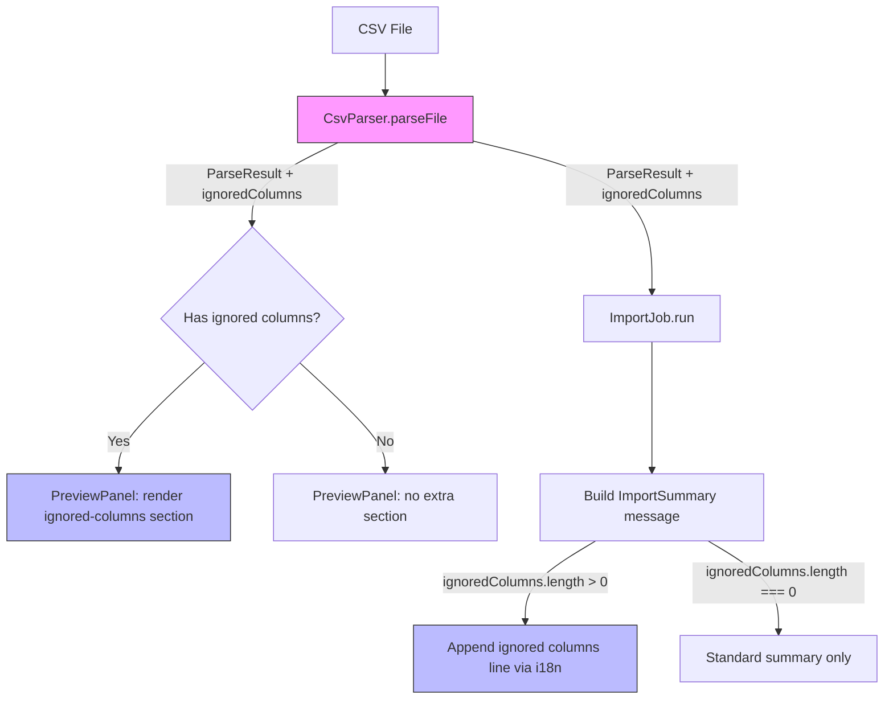

# Design Document: Ignore Columns

## Overview

This feature extends the Fastlate CSV parser to recognize and skip metadata columns ("Local" and "Seção") that do not represent language data. The ignored column names are surfaced in the PreviewPanel and ImportSummary so translators can confirm which columns were excluded. All new user-facing strings support English and Portuguese (pt-BR) via the existing i18n module.

### Design Decisions

1. **Hardcoded ignore list** — The ignore list (`["Local", "Seção"]`) is defined as a constant inside `CsvParser`. This avoids configuration complexity for a well-known, static set of metadata column names. If future columns need to be ignored, the list can be extended in one place.

2. **Case-insensitive, trim-based matching** — Column headers are trimmed and compared case-insensitively against the ignore list. This handles common CSV variations (extra spaces, inconsistent casing) without requiring user intervention.

3. **ParseResult extension** — Rather than creating a separate return type, we add an optional `ignoredColumns` field to the existing `ParseResult` interface. This keeps the API surface minimal and backward-compatible.

4. **UI truncation at 50 items** — The PreviewPanel caps the visible ignored-column list at 50 entries to prevent layout issues with pathological CSVs while still providing a "+N more" indicator.

## Architecture



**Data flow:**
1. `CsvParser.parseFile()` detects ignored columns during header extraction, excludes them from `languageHeaders`, and populates `ParseResult.ignoredColumns`.
2. The `PreviewPanel` receives the full `ParseResult` and conditionally renders the ignored-columns section.
3. The summary builder (in extension orchestration code) appends the ignored-columns line to the `ImportSummary` message when `ignoredColumns` is non-empty.

## Components and Interfaces

### CsvParser (modified)

```typescript
// src/parser/CsvParser.ts

/** Column names that are recognized as metadata and excluded from language processing. */
const IGNORED_COLUMN_NAMES: readonly string[] = ['local', 'seção'];

export class CsvParser {
  parseFile(
    filePath: string,
    logger?: ParserLogger,
    defaultLanguage?: string,
  ): Result<ParseResult, ParseError> {
    // ... existing parsing logic ...
    // NEW: After extracting raw column headers from row 1:
    //   1. For each column (starting at languageStartColumn), trim + lowercase the header
    //   2. If it matches an entry in IGNORED_COLUMN_NAMES → add original trimmed name to ignoredColumns[], skip column
    //   3. Otherwise → process as language header
    //   4. If no language headers remain → return { kind: 'missing_language_header' }
    //   5. When building Term.values arrays, skip indices that correspond to ignored columns
    // ...
  }
}
```

### ParseResult (extended)

```typescript
// src/types/index.ts — addition to existing interface
export interface ParseResult {
  languageHeader: LanguageHeader;
  languageHeaders: LanguageHeader[];
  terms: Term[];
  /** Column names from row 1 that were recognized as metadata and excluded. */
  ignoredColumns: string[];
}
```

### PreviewPanel (modified)

```typescript
// src/ui/PreviewPanel.ts — additions

export interface PreviewOptions {
  parseResult: ParseResult; // now includes ignoredColumns
  extensionUri: vscode.Uri;
}

// In _buildHtml():
//   - After the import-status div, conditionally render an ignored-columns section
//   - Section heading: t('preview.ignoredColumns')
//   - List items: each escaped column name, capped at 50
//   - If count > 50: show "+{remaining} more" indicator
```

### ImportSummary message builder

The summary message construction (currently in the extension orchestration layer that calls `t('summary.done', ...)`) will be extended:

```typescript
// After building the base summary string:
if (ignoredColumns.length > 0) {
  summaryMessage += '\n' + t('summary.ignoredColumns') + ': ' + ignoredColumns.join(', ');
}
```

### i18n module (extended)

```typescript
// src/i18n.ts — new keys added to MessageKey union and both locale objects

// MessageKey additions:
| 'preview.ignoredColumns'
| 'summary.ignoredColumns'

// en additions:
'preview.ignoredColumns': 'Ignored columns',
'summary.ignoredColumns': 'Ignored columns',

// pt additions:
'preview.ignoredColumns': 'Colunas ignoradas',
'summary.ignoredColumns': 'Colunas ignoradas',
```

## Data Models

### ParseResult (updated)

| Field | Type | Description |
|-------|------|-------------|
| `languageHeader` | `LanguageHeader` | First language metadata (backward compat) |
| `languageHeaders` | `LanguageHeader[]` | All valid language columns (excluding ignored) |
| `terms` | `Term[]` | Parsed terms with values only from language columns |
| `ignoredColumns` | `string[]` | **NEW** — Original trimmed header names of ignored columns, in CSV order |

### IGNORED_COLUMN_NAMES constant

| Index | Value (lowercase) | Original display |
|-------|-------------------|-----------------|
| 0 | `"local"` | "Local" |
| 1 | `"seção"` | "Seção" |

Matching algorithm:
```
header.trim().toLowerCase() === entry
```

### i18n keys (new)

| Key | en | pt-BR |
|-----|----|----|
| `preview.ignoredColumns` | "Ignored columns" | "Colunas ignoradas" |
| `summary.ignoredColumns` | "Ignored columns" | "Colunas ignoradas" |


## Correctness Properties

*A property is a characteristic or behavior that should hold true across all valid executions of a system — essentially, a formal statement about what the system should do. Properties serve as the bridge between human-readable specifications and machine-verifiable correctness guarantees.*

### Property 1: Ignored columns are excluded from parsing output

*For any* valid CSV containing one or more columns whose row-1 header, after trimming and lowercasing, matches an entry in the ignore list ("local", "seção"), the resulting `ParseResult.languageHeaders` SHALL NOT contain a `LanguageHeader` for those columns, and no `Term.values` array SHALL contain a `TermValue` at the position of those columns.

**Validates: Requirements 1.1, 1.2, 1.5**

### Property 2: ignoredColumns array contains correct names in CSV order

*For any* valid CSV with N columns (where some are ignored and at least one valid language column remains), the `ParseResult.ignoredColumns` array SHALL contain exactly the original trimmed header values of the matched columns, in the same left-to-right order they appeared in the CSV. When no columns match, the array SHALL be empty.

**Validates: Requirements 1.3, 1.4**

### Property 3: Ignored-columns section renders with correct content when present

*For any* `ParseResult` with a non-empty `ignoredColumns` array (up to 50 items), the PreviewPanel HTML output SHALL contain a heading with the localized "Ignored columns" label and SHALL list each column name as a separate item in the same order as the array.

**Validates: Requirements 2.1, 2.2**

### Property 4: Ignored-columns section is absent when list is empty

*For any* `ParseResult` with an empty `ignoredColumns` array, the PreviewPanel HTML output SHALL NOT contain the ignored-columns section heading or any related markup.

**Validates: Requirements 2.3**

### Property 5: HTML special characters in column names are escaped

*For any* column name string containing HTML special characters (& < > " '), when rendered in the ignored-columns section of the PreviewPanel, the output SHALL contain only the escaped entity equivalents (&amp; &lt; &gt; &quot; &#39;) and never the raw special characters within data content.

**Validates: Requirements 2.4**

### Property 6: Truncation at 50 with remaining count indicator

*For any* `ignoredColumns` array with length > 50, the PreviewPanel HTML output SHALL render exactly the first 50 column names and SHALL display a text indicator showing the count of remaining items (length − 50). For arrays with length ≤ 50, all names SHALL be rendered without a truncation indicator.

**Validates: Requirements 2.5**

### Property 7: Summary message correctly includes or omits ignored columns line

*For any* `ImportSummary` and `ignoredColumns` array, when `ignoredColumns` is non-empty the summary message SHALL end with a newline followed by the i18n label `summary.ignoredColumns` and the column names joined by ", " in their original order and casing. When `ignoredColumns` is empty, the summary message SHALL be identical to the standard `summary.done` format with no additional text.

**Validates: Requirements 3.1, 3.2, 3.3, 3.4**

## Error Handling

| Scenario | Behavior | Error Kind |
|----------|----------|-----------|
| All non-key columns are ignored (no language columns remain) | Return error result | `missing_language_header` |
| Column header contains only whitespace after trimming | Treated as empty — existing behavior (skipped or triggers `missing_language_header`) | N/A |
| `ignoredColumns` contains names with special characters | Names are preserved as-is in `ParseResult`; HTML escaping applied at render time | N/A |
| CSV has no row-1 headers at all | Existing error handling unchanged (`missing_language_header` or `insufficient_columns`) | Existing |

The feature does not introduce new error types — it reuses the existing `missing_language_header` error for the edge case where all non-key columns are ignored.

## Testing Strategy

### Property-Based Tests (fast-check, minimum 100 iterations each)

The project uses **fast-check** (`^4.8.0`) with **Jest** (`29.7.0`). Each property test file follows the existing naming convention: `<Component>.<aspect>.property.test.ts`.

| Test File | Property | Description |
|-----------|----------|-------------|
| `CsvParser.ignore-columns.property.test.ts` | Property 1 | Generates CSVs with random ignored columns (varied casing/whitespace/position) among valid language columns. Verifies excluded from output. |
| `CsvParser.ignore-columns.property.test.ts` | Property 2 | Same generator — verifies `ignoredColumns` array content and order. |
| `PreviewPanel.ignore-columns.property.test.ts` | Property 3 | Generates random `ParseResult` objects with 1–50 ignored column names. Verifies HTML contains heading + all names in order. |
| `PreviewPanel.ignore-columns.property.test.ts` | Property 4 | Generates `ParseResult` with empty `ignoredColumns`. Verifies no section rendered. |
| `PreviewPanel.ignore-columns.property.test.ts` | Property 5 | Generates column names with HTML special chars. Verifies escaping. |
| `PreviewPanel.ignore-columns.property.test.ts` | Property 6 | Generates arrays of 1–100 column names. Verifies truncation behavior. |
| `ImportSummary.ignore-columns.property.test.ts` | Property 7 | Generates random `ImportSummary` + ignored column lists. Verifies message format. |

**Tag format:** Each test includes a comment: `// Feature: ignore-columns, Property N: <description>`

**Configuration:** `{ numRuns: 100, verbose: true }`

### Unit Tests (example-based)

| Test File | Coverage |
|-----------|----------|
| `CsvParser.test.ts` | Edge case: all columns ignored → `missing_language_header` error (Req 1.6) |
| `CsvParser.test.ts` | Example: CSV with "Local" and "Seção" among valid columns → correct exclusion |
| `i18n.test.ts` | `summary.ignoredColumns` key exists in en with value "Ignored columns" (Req 4.1) |
| `i18n.test.ts` | `summary.ignoredColumns` key exists in pt with value "Colunas ignoradas" (Req 4.2) |
| `i18n.test.ts` | `t('summary.ignoredColumns')` supports parameterized interpolation (Req 4.3) |
| `PreviewPanel.test.ts` | Example: section renders correctly with known column names |

### Test Generators (for property tests)

- **CSV generator**: Produces valid 2-row headers with random language columns + 0–N ignored columns at random positions, followed by 1–20 data rows.
- **Column name generator**: Non-empty trimmed strings, including Unicode, diacritics, and HTML special characters.
- **Case/whitespace variation generator**: Takes a known ignored name and applies random casing transforms + leading/trailing whitespace.
- **ParseResult generator**: Builds valid `ParseResult` objects with configurable `ignoredColumns` arrays.
