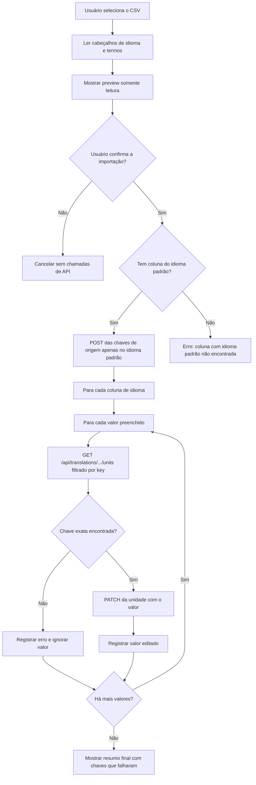

# Fastlate

Extensão VSCode para importar traduções de arquivos CSV para o Weblate.

---

## Instalação

### 1. Instalar a extensão

Baixe o arquivo `.vsix` mais recente e instale no VSCode:

- Abra o VSCode → Extensions → menu `...` → `Install from VSIX...` → selecione o arquivo `.vsix`

Ou via terminal:

```powershell
code --install-extension fastlate-0.0.1.vsix
```

### 2. Configurar

Depois de instalar, configure estas opções no `settings.json` do VSCode:

- `fastlate.serverUrl` — URL base do servidor Weblate
- `fastlate.project` — slug do projeto no Weblate
- `fastlate.component` — slug do componente no Weblate
- `fastlate.defaultLanguage` — código do idioma padrão (obrigatório; o CSV deve conter esta coluna, que serve como idioma fonte das chaves)

Configure o token com o comando `Fastlate: Configurar token`. O token é salvo no `SecretStorage` do VSCode, não no `settings.json`. Para remover o token salvo, use `Fastlate: Remover token`.

### 3. Usar

Use a view `Fastlate` na Activity Bar ou execute o comando `Fastlate: Importar Traduções`.

---

## Referência de CSV do Fastlate

O Fastlate aceita arquivos CSV com delimitador ponto e vírgula (`;`), com uma coluna dedicada para chave ou apenas com colunas de idioma.

Formato com coluna dedicada para chave:

| Linha | Coluna A | Colunas B+ |
|-------|----------|------------|
| 1 | Rótulo ignorado | Nomes dos idiomas, um por coluna de idioma |
| 2 | Rótulo ignorado | Códigos dos idiomas correspondentes aos nomes acima |
| 3+ | Chave de tradução | Valores de tradução para cada idioma |

Exemplo com coluna de chave:

```csv
label;Português;English;Español
code;pt;en;es
button.save;Salvar;Save;Guardar
button.cancel;Cancelar;Cancel;Cancelar
```

Formato somente com idiomas:

| Linha | Colunas A+ |
|-------|------------|
| 1 | Nomes dos idiomas, um por coluna |
| 2 | Códigos dos idiomas correspondentes aos nomes acima |
| 3+ | Valores de tradução para cada idioma |

Exemplo sem coluna de chave:

```csv
Português;Inglês;Espanhol;Francês
pt_BR;en;es;fr
bola;ball;pelota;balle
```

No formato somente com idiomas, o valor da coluna configurada em `fastlate.defaultLanguage` é usado como chave no Weblate. Se `fastlate.defaultLanguage` estiver configurado como `pt_BR`, no exemplo acima `bola` é a chave.

### Colunas ignoradas

Colunas cujo nome na linha 1 seja **"Local"** ou **"Seção"** (comparação case-insensitive, com trim de espaços) são reconhecidas como metadados e automaticamente excluídas do processamento de idiomas. Elas não aparecem como colunas de idioma no preview nem geram chamadas de API.

- O preview exibe uma seção "Colunas ignoradas" listando os nomes originais das colunas excluídas.
- O resumo final de importação também lista as colunas ignoradas.
- Se **todas** as colunas não-chave forem ignoradas (nenhuma coluna de idioma restar), o Fastlate retorna o erro `missing_language_header`.

Exemplo de CSV com colunas ignoradas:

```csv
label;Local;Português;Seção;English
code;xx;pt;xx;en
button.save;tela1;Salvar;botões;Save
```

Neste exemplo, "Local" e "Seção" são ignoradas e apenas "Português" e "English" são processadas como idiomas.

### Valores com ponto e vírgula

Como o delimitador do CSV é `;`, valores que contenham ponto e vírgula literal devem estar **entre aspas** no arquivo (padrão RFC 4180). A maioria dos editores de planilha (Excel, Google Sheets, LibreOffice) faz isso automaticamente ao exportar. Em CSVs editados manualmente, certifique-se de usar quoting:

```csv
label;Português;English
code;pt;en
greeting;"Olá; bem-vindo";Hello
```

Se o valor não estiver entre aspas, o `;` será interpretado como separador de coluna e a linha ficará desalinhada.

### Regras do CSV

- No formato com chave dedicada, a coluna A é a chave de tradução e as colunas B em diante são colunas de idioma.
- No formato somente com idiomas, as colunas A em diante são colunas de idioma.
- `fastlate.defaultLanguage` é obrigatório; o CSV deve conter uma coluna com esse código na linha 2. Essa coluna serve como idioma fonte das chaves e é o único idioma que cria chaves via `POST`.
- A linha 1 deve conter o nome do idioma para cada coluna de idioma preenchida.
- A linha 2 deve conter o código de idioma correspondente para cada coluna de idioma preenchida.
- As linhas 3 em diante contêm chaves e valores de tradução.
- Uma linha só é ignorada quando a chave está vazia ou todas as células de valor dos idiomas estão vazias.
- Células de valor vazias são ignoradas para aquele idioma, enquanto outros valores preenchidos da mesma chave continuam sendo importados.

O preview de importação mostra `Chave` mais uma coluna de valor para cada idioma declarado no cabeçalho.

### Fluxo de importação

- O Fastlate envia `POST` somente para criar a chave de origem no idioma configurado em `fastlate.defaultLanguage`.
- O corpo do `POST` de criação contém a chave e o valor da coluna do idioma padrão.
- Se o Weblate retornar HTTP 400 com qualquer mensagem de resposta contendo `already exist`, o Fastlate registra um aviso e continua.
- Se o CSV não tiver uma coluna cujo código seja igual a `fastlate.defaultLanguage`, o Fastlate interrompe a importação com o erro `Coluna com idioma padrão não encontrada`.
- O Fastlate nunca envia `POST` de criação de chave para endpoints de idiomas diferentes do idioma padrão configurado.
- Para cada valor preenchido, o Fastlate busca a unidade com `GET /api/translations/{project}/{component}/{language}/units/?q=key:="{key}"`.
- O Fastlate só envia `PATCH` depois que a chave exata é encontrada naquele idioma.
- Se a chave exata não for encontrada para um idioma, o Fastlate ignora aquele valor e registra um erro.
- Depois que a importação começa, o preview permanece aberto para conferência.
- Se algum valor falhar, a notificação final inclui as chaves afetadas.

### Estimativa de limite de requisições

Como o fluxo faz `1 POST` por chave no idioma padrão e, para cada valor preenchido, faz `1 GET` mais `1 PATCH`, a estimativa é:

```txt
requisições = chaves + (valores preenchidos × 2)
```

Quando todas as chaves têm valor em todos os idiomas:

```txt
requisições = chaves × (1 + 2 × idiomas)
chaves por hora = limite por hora / (1 + 2 × idiomas)
```

Exemplo com limite de 5000 requisições por hora:

| Idiomas no CSV | Requisições por chave | Chaves por hora |
|----------------|-----------------------|-----------------|
| 1 | 3 | 1666 |
| 2 | 5 | 1000 |
| 3 | 7 | 714 |
| 4 | 9 | 555 |
| 5 | 11 | 454 |

Use uma margem abaixo do limite quando houver retries, erros temporários ou valores ausentes/preenchidos de forma irregular.

### Diagrama do fluxo



---

## Manutenção (Desenvolvedores)

### Requisitos

- Node.js >= 18
- npm >= 9

### Setup do ambiente

```bash
npm install
npm run compile
npm run test
```

### Gerar o pacote .vsix

```powershell
npx vsce package
```

Se o `vsce` não estiver disponível globalmente:

```powershell
npm install -g @vscode/vsce
```

### Debug

Abra o projeto no VSCode e pressione `F5`. Uma nova janela (Extension Development Host) será aberta com a extensão carregada. Breakpoints funcionam normalmente.

### Scripts disponíveis

| Script | Descrição |
|--------|-----------|
| `npm run compile` | Compila o TypeScript |
| `npm run watch` | Compila em modo watch |
| `npm run lint` | Executa o ESLint |
| `npm test` | Executa os testes com Jest |
| `npm run test:coverage` | Testes com relatório de cobertura |
| `npm run package:vsix` | Gera o arquivo `.vsix` |
