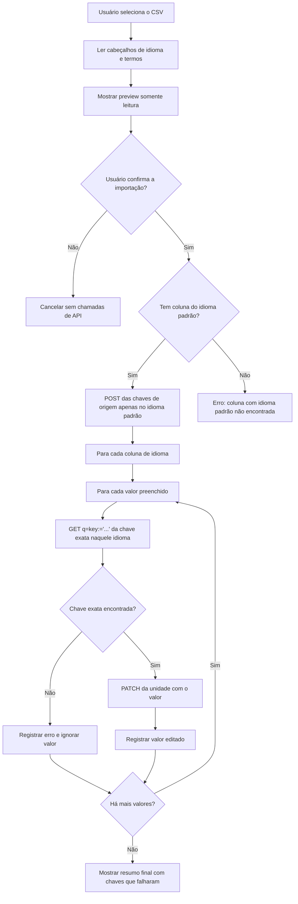

# Fastlate

Monorepo privado para extensões internas do VSCode.

## Estrutura

```text
Fastlate/
|-- packages/
|   `-- fastlate/        # Fastlate: extensão VSCode para importar traduções no Weblate
|-- package.json         # Raiz do workspace
|-- .gitignore
`-- README.md
```

## Pacotes

| Pacote | Descrição |
|--------|-----------|
| `fastlate` | Fastlate: extensão VSCode para importar traduções no Weblate |

## Começando

```bash
# Instalar todas as dependências do workspace
npm install

# Compilar todos os pacotes
npm run build

# Rodar testes em todos os pacotes
npm run test
```

## Requisitos

- Node.js >= 18
- npm >= 9

## Instalando o Fastlate localmente

Gere e instale a extensão como um pacote local `.vsix` do VSCode:

```powershell
cd C:\GitHub_Repos\Fastlate\packages\fastlate
npx vsce package
code --install-extension fastlate-0.0.1.vsix
```

Se o `vsce` não estiver disponível, instale antes:

```powershell
npm install -g @vscode/vsce
```

Também é possível instalar o `.vsix` gerado pelo VSCode: abra Extensions, clique no menu `...`, escolha `Install from VSIX...` e selecione o arquivo gerado.

Depois de instalar, configure estas opções do VSCode:

- `fastlate.serverUrl`
- `fastlate.project`
- `fastlate.component`
- `fastlate.defaultLanguage` (obrigatório; o CSV deve conter esta coluna, que serve como idioma fonte das chaves e é a única usada para criar chaves via `POST`)

Configure o token com o comando `Fastlate: Configurar token`. O token é salvo no `SecretStorage` do VSCode, não no `settings.json`. Para remover o token salvo, use `Fastlate: Remover token`.

Em seguida, use a view `Fastlate` na Activity Bar ou execute o comando `Fastlate: Importar Traduções`.

## Referência de CSV do Fastlate

O Fastlate aceita arquivos CSV com uma coluna dedicada para chave ou apenas com colunas de idioma.

Formato com coluna dedicada para chave:

| Linha | Coluna A | Colunas B+ |
|-------|----------|------------|
| 1 | Rótulo ignorado | Nomes dos idiomas, um por coluna de idioma |
| 2 | Rótulo ignorado | Códigos dos idiomas correspondentes aos nomes acima |
| 3+ | Chave de tradução | Valores de tradução para cada idioma |

Exemplo com coluna de chave:

```csv
label,Português,English,Español
code,pt,en,es
button.save,Salvar,Save,Guardar
button.cancel,Cancelar,Cancel,Cancelar
```

Formato somente com idiomas:

| Linha | Colunas A+ |
|-------|------------|
| 1 | Nomes dos idiomas, um por coluna |
| 2 | Códigos dos idiomas correspondentes aos nomes acima |
| 3+ | Valores de tradução para cada idioma |

Exemplo sem coluna de chave:

```csv
Português;Inglês;Espanhol;Francês
pt_BR;en;es;fr
bola;ball;pelota;balle
```

No formato somente com idiomas, o valor da coluna configurada em `fastlate.defaultLanguage` é usado como chave no Weblate. Se `fastlate.defaultLanguage` estiver configurado como `pt_BR`, no exemplo acima `bola` é a chave.

Regras:

- No formato com chave dedicada, a coluna A é a chave de tradução e as colunas B em diante são colunas de idioma.
- No formato somente com idiomas, as colunas A em diante são colunas de idioma.
- `fastlate.defaultLanguage` é obrigatório; o CSV deve conter uma coluna com esse código na linha 2. Essa coluna serve como idioma fonte das chaves e é o único idioma que cria chaves via `POST`.
- A linha 1 deve conter o nome do idioma para cada coluna de idioma preenchida.
- A linha 2 deve conter o código de idioma correspondente para cada coluna de idioma preenchida.
- As linhas 3 em diante contêm chaves e valores de tradução.
- Uma linha só é ignorada quando a chave está vazia ou todas as células de valor dos idiomas estão vazias.
- Células de valor vazias são ignoradas para aquele idioma, enquanto outros valores preenchidos da mesma chave continuam sendo importados.

O preview de importação mostra `Chave` mais uma coluna de valor para cada idioma declarado no cabeçalho.

Fluxo de importação:

- O Fastlate envia `POST` somente para criar a chave de origem no idioma configurado em `fastlate.defaultLanguage`.
- O corpo do `POST` de criação contém a chave e o valor da coluna do idioma padrão.
- Se o Weblate retornar HTTP 400 com qualquer mensagem de resposta contendo `already exist`, o Fastlate registra um aviso e continua.
- Se o CSV não tiver uma coluna cujo código seja igual a `fastlate.defaultLanguage`, o Fastlate interrompe a importação com o erro `Coluna com idioma padrão não encontrada`.
- O Fastlate nunca envia `POST` de criação de chave para endpoints de idiomas diferentes do idioma padrão configurado.
- Para cada valor de idioma preenchido, o Fastlate pesquisa a chave exata naquele idioma com `q=key:="{chave}"` e usa o ID da unidade retornado.
- O Fastlate só envia `PATCH` depois que a chave exata é encontrada naquele idioma.
- Se a chave exata não for encontrada para um idioma, o Fastlate ignora aquele valor e registra um erro.
- Depois que a importação começa, o preview permanece aberto para conferência.
- Se algum valor falhar, a notificação final inclui as chaves afetadas.


