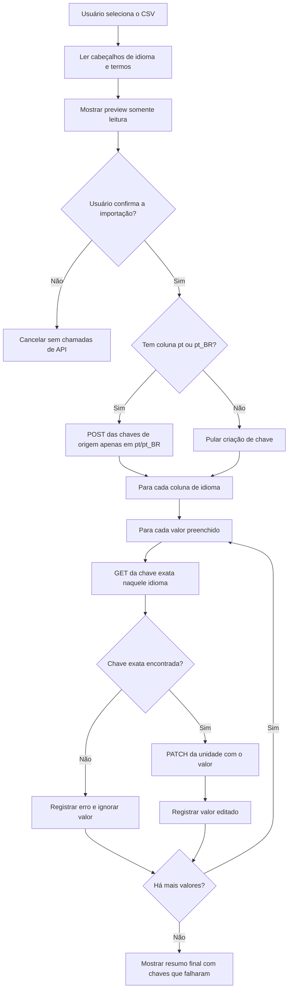

# Fastlate

Monorepo privado para extensões internas do VSCode.

## Estrutura

```text
Fastlate/
|-- packages/
|   `-- fastlate/        # Fastlate: extensão VSCode para importar traduções no Weblate
|-- package.json         # Raiz do workspace
|-- .gitignore
`-- README.md
```

## Pacotes

| Pacote | Descrição |
|--------|-----------|
| `fastlate` | Fastlate: extensão VSCode para importar traduções no Weblate |

## Começando

```bash
# Instalar todas as dependências do workspace
npm install

# Compilar todos os pacotes
npm run build

# Rodar testes em todos os pacotes
npm run test
```

## Requisitos

- Node.js >= 18
- npm >= 9

## Instalando o Fastlate localmente

Gere e instale a extensão como um pacote local `.vsix` do VSCode:

```powershell
cd C:\GitHub_Repos\Fastlate\packages\fastlate
npx vsce package
code --install-extension fastlate-0.0.1.vsix
```

Se o `vsce` não estiver disponível, instale antes:

```powershell
npm install -g @vscode/vsce
```

Também é possível instalar o `.vsix` gerado pelo VSCode: abra Extensions, clique no menu `...`, escolha `Install from VSIX...` e selecione o arquivo gerado.

Depois de instalar, configure estas opções do VSCode:

- `fastlate.serverUrl`
- `fastlate.project`
- `fastlate.component`

Configure o token com o comando `Fastlate: Configurar token`. O token é salvo no `SecretStorage` do VSCode, não no `settings.json`. Para remover o token salvo, use `Fastlate: Remover token`.

Em seguida, use a view `Fastlate` na Activity Bar ou execute o comando `Fastlate: Importar Traduções`.

## Referência de CSV do Fastlate

O Fastlate aceita arquivos CSV com uma coluna dedicada para chave ou apenas com colunas de idioma.

Formato com coluna dedicada para chave:

| Linha | Coluna A | Colunas B+ |
|-------|----------|------------|
| 1 | Rótulo ignorado | Nomes dos idiomas, um por coluna de idioma |
| 2 | Rótulo ignorado | Códigos dos idiomas correspondentes aos nomes acima |
| 3+ | Chave de tradução | Valores de tradução para cada idioma |

Exemplo com coluna de chave:

```csv
label,Português,English,Español
code,pt,en,es
button.save,Salvar,Save,Guardar
button.cancel,Cancelar,Cancel,Cancelar
```

Formato somente com idiomas:

| Linha | Colunas A+ |
|-------|------------|
| 1 | Nomes dos idiomas, um por coluna |
| 2 | Códigos dos idiomas correspondentes aos nomes acima |
| 3+ | Valores de tradução para cada idioma |

Exemplo sem coluna de chave:

```csv
Português;Inglês;Espanhol;Francês
pt_BR;en;es;fr
bola;ball;pelota;balle
```

No formato somente com idiomas, o valor da coluna `pt` ou `pt_BR` é usado como chave no Weblate. No exemplo acima, `bola` é a chave.

Regras:

- No formato com chave dedicada, a coluna A é a chave de tradução e as colunas B em diante são colunas de idioma.
- No formato somente com idiomas, as colunas A em diante são colunas de idioma.
- A linha 1 deve conter o nome do idioma para cada coluna de idioma preenchida.
- A linha 2 deve conter o código de idioma correspondente para cada coluna de idioma preenchida.
- As linhas 3 em diante contêm chaves e valores de tradução.
- Uma linha só é ignorada quando a chave está vazia ou todas as células de valor dos idiomas estão vazias.
- Células de valor vazias são ignoradas para aquele idioma, enquanto outros valores preenchidos da mesma chave continuam sendo importados.

O preview de importação mostra `Chave` mais uma coluna de valor para cada idioma declarado no cabeçalho.

Fluxo de importação:

- O Fastlate envia `POST` somente para criar a chave de origem no idioma principal `pt` ou `pt_BR`.
- O corpo do `POST` de criação contém a chave e o valor principal em português.
- Se o Weblate retornar HTTP 400 com qualquer mensagem de resposta contendo `already exist`, o Fastlate registra um aviso e continua.
- Se o CSV não tiver coluna `pt` ou `pt_BR`, o Fastlate não envia nenhum `POST` de criação de chave.
- O Fastlate nunca envia `POST` de criação de chave para endpoints de idiomas não portugueses, como `en`, `es` ou `fr`.
- Para cada valor de idioma preenchido, o Fastlate pesquisa a chave exata naquele idioma e usa o ID da unidade retornado.
- O Fastlate só envia `PATCH` depois que a chave exata é encontrada naquele idioma.
- Se a chave exata não for encontrada para um idioma, o Fastlate ignora aquele valor e registra um erro.
- Depois que a importação começa, o preview permanece aberto para conferência.
- Se algum valor falhar, a notificação final inclui as chaves afetadas.



## Mudanças recentes

- Fastlate: faz o botão de importação do preview mudar visualmente para `Importando...` enquanto os termos são enviados.
- Fastlate: atualiza o estado do preview para concluído ou erro depois que a importação termina.
- Fastlate: re-renderiza o painel de preview para os estados de progresso e finalização da importação.
- Fastlate: mantém o preview de importação aberto após enviar os termos e lista as chaves com falha na notificação final.
- Fastlate: restaurou a criação via `POST` com valor principal antes da busca exata e do `PATCH`.
- Fastlate: trata respostas HTTP 400 de chave duplicada do Weblate como avisos quando qualquer mensagem de resposta contém `already exist`.
- Fastlate: aceita HTTP 200 e 201 do Weblate como respostas de criação de chave bem-sucedidas.
- Fastlate: impede `POST` de criação de chave quando o CSV não tem coluna `pt` ou `pt_BR`.
- Fastlate: atualizou a referência de CSV, parser, preview e fluxo de importação para aceitar várias colunas de idioma.
- Fastlate: concluiu a cobertura da Property 3 do parser para filtragem de linhas inválidas e atualizou `fast-check` para `^4.8.0`.
- Fastlate: adicionou cobertura unitária para o HTML somente leitura do `PreviewPanel`.
- Fastlate: adicionou cobertura de propriedades garantindo que o `PreviewPanel` renderize todos os dados parseados.
- Fastlate: adicionou cobertura unitária para tratamento de status, headers de autorização e retentativas do `WeblateHttpClient`.
- Fastlate: adicionou cobertura de propriedades garantindo que as requisições para a API do Weblate sempre incluam o token de autorização.
- Fastlate: adicionou cobertura de propriedades para o comportamento de retentativa de rede do `WeblateHttpClient`.
- Fastlate: adicionou cobertura unitária para fluxos de criação, edição, erro, autenticação, cancelamento e progresso do `ImportJob`.
- Fastlate: adicionou cobertura de propriedades para a sequência de chamadas de API do `ImportJob`.
- Fastlate: adicionou cobertura de propriedades para a correção do resumo final do `ImportJob`.
- Fastlate: adicionou cobertura de integração para o fluxo completo do comando de importação.
- Fastlate: concluiu o checkpoint final com a suíte completa de testes passando.
- Fastlate: reconciliou a cobertura unitária opcional do `ConfigurationService`.
- Fastlate: reconciliou a cobertura de propriedades opcional do `ConfigurationService`.
- Fastlate: reconciliou a cobertura unitária opcional do `CsvParser`.
- Fastlate: reconciliou a cobertura de propriedade round-trip opcional do `CsvParser`.
- Fastlate: reconciliou a cobertura de invariância de delimitador opcional do `CsvParser`.
- Fastlate: atualizou dependências de desenvolvimento para resolver vulnerabilidades do `npm audit`.
- Fastlate: removeu a configuração redundante de idioma; as importações agora usam o código do `Language_Header` do CSV.
- Fastlate: adicionou uma view na Activity Bar com status de configuração e ação de importação.
